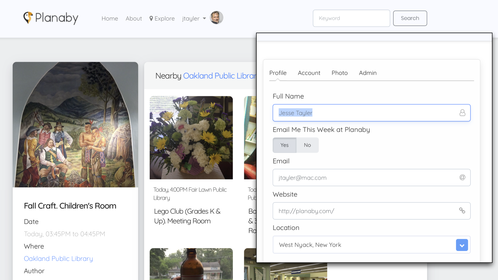

# BootstrapModernLook

This is an extension of Wonder's ERModernLook framework. Simply linking to this framework, and including links in your PageWrapper to CDNs should cause your entire app to suddenly look beautiful, elegant and modern! 

This framework is designed to support modern Bootstrap (v.4.1) and specifically Shards style UI. The framework provides the D2W Custom Rules and Components to override where needed and to provide completely modern UI forms, tables and cards all available to D2W.

https://designrevision.com/downloads/shards/

https://getbootstrap.com/docs/4.1/getting-started/introduction/

This framework piggybacks on ERDModernLook and provides rules, css, CDN import links for .js and .css that is needed as well as a number of components to override the repetitions or allow for css tags and modern interface attributes.

These additional components accept rule based tagging for you to adjust the styling of any D2W List Page or input form etc., you might adjust a rule like:

<code>
      100 : *true* => baseClassForObjectTable = table table-borderless table-md
</code>

There are also new components for UI elements such as Datepickers, Cards, Buttons, Carousels, Progress Bars and FontAwesome glyphs inside of Input fields.

https://designrevision.com/docs/shards/cards.html

https://designrevision.com/docs/shards/using-icons.html

<code>
    10 : *true* => baseClassForCancelButtonSpan = fa fa-sign-in mr-2
</code>

D2W Rules control button styles, or provide appending glyphs for forms.

Rules control complex multi-part components, such as Cards which have optional titles, text areas, footers, images in any compbination.

<code>
      120 : entity.name = 'Mtly' => cardSectionsContents = {"card-img-top" = "object.imageURL"; "card-link" = "object.publicURLString"; "card-text" = "object.title"; "card-title" = "object.venue.title"; }
</code>
      
      
Control the button link, formatting options sizing grid options

https://designrevision.com/docs/shards/cards.html

If you cardSectionsContents dictionary contains a key matching the css pattern in the Card documentation, "card-title" = "object.venue.title"; then that item appears and renders the value of the key path indicated.

Other elements are text/html string details

<code>
        "card-link-title" = "Tell me more &rarr;"; 
</code>

Set the repetitionComonentName and turn any list into a complex card or carousel

<code>
      60 : (pageConfiguration = 'ListMtly-Author' or pageConfiguration = 'ListBookmark-Author') => repetitionComponentName = BMLCardRepetition [com.webobjects.directtoweb.Assignment]
      </code>
      

