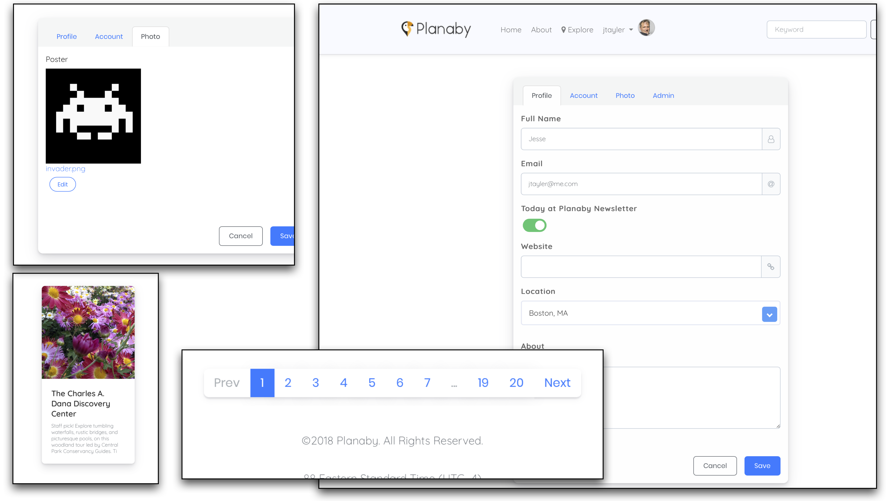

# BootstrapModernLook

This framework is designed to support modern Bootstrap (v.4.1) and specifically Shards style UI using ERDModernLook. This framework provides the D2W Custom Rules and Components to override where needed, and to provide completely modern UI for forms, tables navigation bars, carousels and cards —all available via D2W.

https://designrevision.com/downloads/shards/

https://getbootstrap.com/docs/4.1/getting-started/introduction/

Components accept rule based css tagging for you to adjust the styling of any D2W List Page or input form etc., you might adjust a rule like this to control the cancel button look according to shards button look

https://designrevision.com/docs/shards/buttons.html

<code>
      *true* => baseClassForObjectTable = "table table-borderless table-md"
</code>

There are also new components for UI elements such as Datepickers, Cards, Buttons, Carousels, Progress Bars and FontAwesome glyphs inside of Input fields. D2W Rules control button styles, or provide appending glyphs for forms.

https://designrevision.com/docs/shards/cards.html

https://designrevision.com/docs/shards/using-icons.html

<code>
      *true* => baseClassForCancelButtonSpan = "fa fa-sign-in mr-2"
</code>

Rules control complex multi-part components, such as Cards or Carousels which have optional titles, text areas, footers, images in any compbination. By providing titles or keypath selector strings in the form of a dictionary, where keys are named after their css controll counterparts found in Bootsrap and Shards.

https://designrevision.com/docs/shards/cards.html

<code>
      entity.name = 'Post' => cardSectionsContents = {
            "card-img-top" = "object.imageURL"; 
            "card-link" = "object.publicURLString"; 
            "card-text" = "object.title"; 
            "card-title" = "object.venue.title"; 
            "cardLInkTitle" = "Tell me more &rarr;"; 
      }
</code>

      
Keypath selector keys controlling Bootsrap elements return values based on the current object and context. Other Keypath selector keys return normal text/html string details, such as cardLInkTitle

<code>
      "cardLInkTitle" = "Tell me more &rarr;"; 
</code>

Each component has extends this metaphore so a single rule can control an arbitrarilty complex UI copmonent.

A simple D2W Rule to set "repetitionComonentName" to either "BMLCardRepetition" or "BMLCarouselRepetition" and turn any list into a complex card or carousel. Empty list messages and batching controls are maintained and styled.

<code>
      60 : (pageConfiguration = 'ListPost-Author' or pageConfiguration = 'ListBookmark-Author') => repetitionComponentName = BMLCardRepetition
</code>

